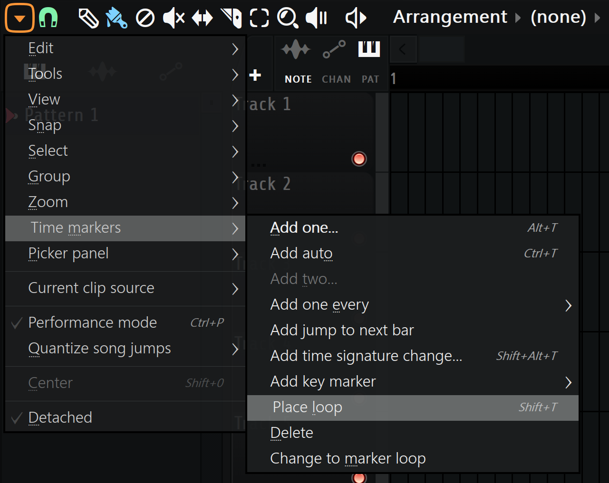
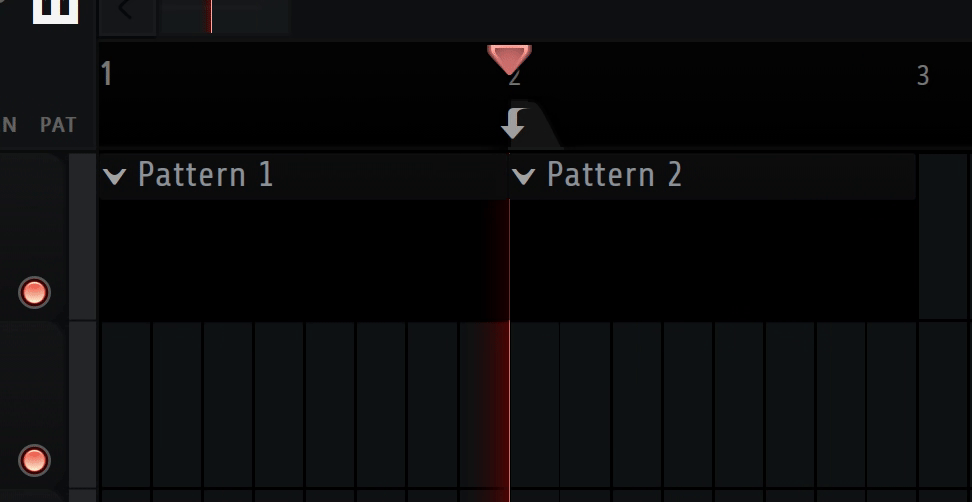
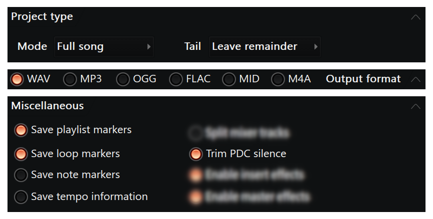

# Preparing your music to be loopable
- Place a loop marker 
## The loop marker can also be adjusted to make the song loop back to a specific segment of the song once the song ends, use this to make the intro only play once 
- When exporting you must use these exact export options when exporting, anything not seen here should be able to be changed,<br> must be either 16bit or 32bit, 24bit is not supported currently<br> 

<!-- Warning: Note markers MUST be disabled so that the cue point for the loop marker can be read correctly (useless warning as long as the user follows the export instructions above)-->

# Using the looped version generated by this script
For engines that support wav files with loop points you can just use the file as-is, however not all engines do<br> so here's how to use it in various engines!
## Roblox
Upload your audio and insert it anywhere, then select your audio in studio and run this script in the command bar:
```lua
local sampleRate = 48000 -- CHANGE THIS!
local loopStart = 1069557 -- CHANGE THIS!
local loopEnd = 3629556 -- CHANGE THIS!
local selectedAudio = game:GetService("Selection"):Get()[1]
assert(selectedAudio:IsA("Sound"), "You need to select a sound first.")
selectedAudio.PlaybackRegionsEnabled = true
selectedAudio.Looped = true
selectedAudio.LoopRegion = NumberRange.new(loopStart / sampleRate, math.clamp(loopEnd / sampleRate, 0, selectedAudio.TimeLength))
selectedAudio.PlaybackRegion = NumberRange.new(0, selectedAudio.TimeLength - (1 / sampleRate))
```
replace sampleRate, loopStart and loopEnd with the output of the script.
## Godot
Godot doesn't support this correctly as it doesn't allow you to input precise loop points, you can get it close by setting Offset (in the import settings) to loopStart divided by the sampleRate
replace sampleRate, loopStart, and loopEnd with the output of the script
## Unity
Unity doesn't support audio loop points. you'll need to implement it yourself or use FMOD/an another alternative sound engine that does support it.